<br/>

<p>
  
  
  
  
  
  &nbsp;
  
  
  
</p>

---

Keep the Claude Code CLI you already know. **opclaude** routes it through any OpenAI-compatible backend — your [opencode](https://opencode.ai) Go subscription, local [Ollama](https://ollama.com) models, or any provider that speaks the OpenAI API. Ships preconfigured with both.

> **Default backends:** [opencode](https://opencode.ai) Go subscription (cloud models — recommended) and Ollama (local + cloud-backed). Swap or add providers by editing `config.yaml`.

## Install

**macOS**
```bash
curl -fsSL https://raw.githubusercontent.com/ayorcodes/opclaude/main/get.sh | bash
```

**Windows** — uses a plain `.cmd` file, no PowerShell execution policy required
```cmd
curl -L https://raw.githubusercontent.com/ayorcodes/opclaude/main/get.cmd -o "%TEMP%\opclaude-get.cmd" && "%TEMP%\opclaude-get.cmd"
```

Or clone and run directly:

```bash
# macOS
git clone https://github.com/ayorcodes/opclaude ~/.opclaude-src
~/.opclaude-src/install.sh
```
```cmd
:: Windows
git clone https://github.com/ayorcodes/opclaude %USERPROFILE%\.opclaude-src
node %USERPROFILE%\.opclaude-src\install.js
```

The installer checks for and optionally installs `uv` and the Claude Code CLI (via `winget` on Windows), prompts for your `OPENCODE_API_KEY` (skip if using Ollama only), generates a random proxy key, and wires up `opclaude` and `opclaude-proxy` on your PATH.

**Prerequisites:** git, Node.js 18+ (Windows only — the macOS installer handles everything)

## Use

```bash
opclaude                          # starts proxy if needed, then runs `claude`
opclaude models                   # list every available model
opclaude --model claude-kimi-2.7  # override default for one session
opclaude set-key                  # rotate OPENCODE_API_KEY, restart proxy
```

```bash
opclaude-proxy status
opclaude-proxy stop
opclaude-proxy restart
```

The proxy stays running between sessions — the next `opclaude` invocation is instant. It binds to `127.0.0.1` only and is never exposed beyond your machine.

## `oc` — auto-route by task

`oc` decides per-task whether you need real Claude or a cheap opencode-Zen model will do, so you don't have to remember to switch yourself. It's opt-in and separate from `opclaude` — plain `claude`/`opclaude` are unaffected.

```bash
oc "rename this variable to camelCase"      # trivial/moderate -> cheap model via the proxy
oc "design a distributed rate limiter"      # critical reasoning -> real Claude (Sonnet, full Pro)
oc "do a full security audit"               # hardest critical subset -> real Claude (Opus)
oc classify "fix this typo"                 # see the routing decision without launching anything
oc --escalate                               # take the last cheap session up to real Claude (Pro)
oc --cheap                                  # continue the most recent session down on the cheap proxy
```

The first decision — cheap vs. real Claude (and Sonnet vs. Opus within critical) — is heuristic first (keyword match, free), falling back to a single cheap-model call through the existing proxy only when ambiguous; it never spends real Claude usage to make the routing decision itself.

Once a cheap session is running, **every turn is auto-routed**: a per-turn classifier in the proxy hook picks the right cheap model for each message (plan/implement/rename/test all land on different models) without you switching anything. Crossing into real Claude mid-conversation isn't possible in one process, so use `oc --escalate` (cheap → Pro) or `oc --cheap` (Pro → cheap) — both carry full context across via session resume.

Tune the model-per-task mappings, the Sonnet/Opus split, and toggle per-turn routing in `~/.config/opclaude/router.yaml`. Every decision is logged to `~/.config/opclaude/router.log` (JSONL) as a base for future routing improvements.

## Models

| name | provider | notes |
|---|---|---|
| `deepseek-v4-pro` | DeepSeek | **default** — no flag needed |
| `kimi-2.7` | Moonshot AI | long-context, fast |
| `qwen-3.5-plus` | Alibaba | `max_tokens` clamped to 8 192 |
| `glm-5.2` | Zhipu AI | thinking blocks stripped |
| `minimax-m3` | Minimax | 204 800-token context, auto-clamped |

Run `opclaude models` any time for the live list.

## How it works

opclaude runs a small [litellm](https://github.com/BerriAI/litellm) proxy on `127.0.0.1` that speaks Anthropic's API to Claude Code on one side, and any OpenAI-compatible backend on the other. Claude Code talks to it exactly like it talks to Anthropic — same CLI, same flags — while opclaude smooths over each model's quirks behind the scenes. opencode is the default cloud backend; Ollama is preconfigured for local models.

<details>
<summary>internals</summary>

- **`config.yaml`** — litellm proxy config: model list (each `claude-*` name maps to a backend model — opencode Zen, Ollama, or any OpenAI-compatible endpoint) plus a registered request hook.
- **`litellm_hooks.py`** — a `CustomLogger` that strips Claude Code's extended-thinking blocks for models that don't support reasoning, and clamps `max_tokens` for providers with stricter limits than Claude Code assumes.
- **`patches/`** — a file-level patch for one litellm streaming bug not fixable from config (`IndexError` on certain streaming responses). Re-apply after any litellm upgrade with `patches/apply.sh` (macOS) or `patches/apply.ps1` (Windows). Full write-up in [FIX.md](FIX.md).

</details>

## Upgrading litellm

```bash
# macOS
uv tool install litellm==<new-version> --python 3.11 --force --with 'litellm[proxy,extra-proxy]'
patches/apply.sh
opclaude-proxy restart
```
```cmd
:: Windows
uv tool install litellm==<new-version> --python 3.11 --force --with "litellm[proxy,extra-proxy]"
powershell -ExecutionPolicy Bypass -File patches\apply.ps1
opclaude-proxy restart
```

> **`--python 3.11` is required.** litellm 1.x crashes on Python 3.13+ due to a FastAPI lifespan incompatibility. uv will download 3.11 automatically if it isn't already cached.

See [FIX.md](FIX.md) if the patch step reports a failed hunk.

## Security

- Proxy binds to `127.0.0.1` only — never exposed beyond your machine.
- Requires `ANTHROPIC_AUTH_TOKEN` to match the generated `LITELLM_MASTER_KEY`; `opclaude` sets this automatically.
- `OPENCODE_API_KEY` and `LITELLM_MASTER_KEY` live only in `~/.config/opclaude/.env`, outside this repo.
